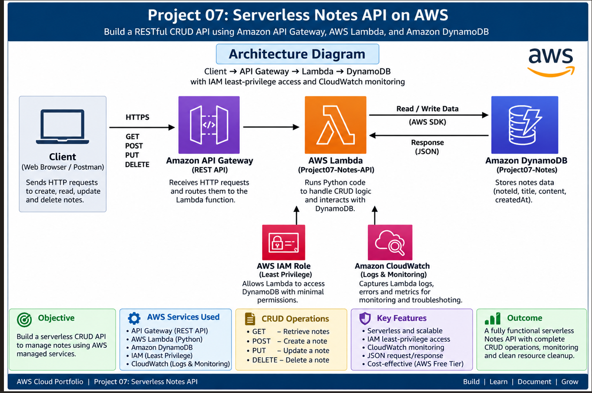

# Project 07 — Serverless Notes API on AWS

## Project Overview

Built a serverless CRUD Notes API using Amazon API Gateway, AWS Lambda, and Amazon DynamoDB.

The project demonstrates how a client can create, retrieve, update, and delete notes through HTTP API requests without managing servers.

## Objective

Build and test a low-cost serverless API that performs:

- Create notes
- Read notes
- Update notes
- Delete notes

## AWS Services Used

- **Amazon API Gateway** — Provides HTTP API endpoints
- **AWS Lambda** — Runs the application logic without servers
- **Amazon DynamoDB** — Stores note data
- **AWS IAM** — Controls Lambda access to DynamoDB
- **Amazon CloudWatch** — Provides Lambda execution logs and monitoring

## Architecture

**Request flow:**

Client → API Gateway → Lambda → DynamoDB

IAM provides controlled access to DynamoDB, while CloudWatch provides Lambda execution logging.

## Implementation Summary

### 1. DynamoDB

Created the `Project07-Notes` table using:

- Partition key: `noteId`
- Data type: String
- Capacity mode: On-demand

### 2. AWS Lambda

Created the `Project07-Notes-API` Lambda function using Python.

The function handles the API's CRUD operations and communicates with DynamoDB.

### 3. API Gateway

Created an HTTP API with the following routes:

| Method | Route | Purpose |
|---|---|---|
| GET | `/notes` | Retrieve notes |
| POST | `/notes` | Create a note |
| PUT | `/notes/{id}` | Update a note |
| DELETE | `/notes/{id}` | Delete a note |

### 4. IAM Security

Created a custom IAM policy following least-privilege principles.

The Lambda function was granted only the DynamoDB permissions required for the application:

- `GetItem`
- `PutItem`
- `UpdateItem`
- `DeleteItem`
- `Scan`

### 5. Testing

Successfully tested all four CRUD operations:

- GET — Retrieved notes
- POST — Created a new note
- PUT — Updated an existing note
- DELETE — Deleted a note

The DELETE operation was also verified by checking DynamoDB after the request.

### 6. Monitoring

Used Amazon CloudWatch to review Lambda execution logs and confirm API activity.

## Key Security Features

- IAM least-privilege permissions
- No database credentials stored in application code
- Serverless architecture
- No EC2 servers or NAT Gateway required
- DynamoDB on-demand capacity

## Skills Demonstrated

- Amazon API Gateway
- AWS Lambda
- Amazon DynamoDB
- AWS IAM
- Amazon CloudWatch
- REST API concepts
- CRUD operations
- Python
- JSON
- Serverless architecture
- IAM least privilege
- AWS troubleshooting and testing

## Project Outcome

Successfully designed, deployed, tested, and documented a serverless CRUD Notes API using AWS managed services.

The project demonstrates the ability to connect API Gateway, Lambda, DynamoDB, IAM, and CloudWatch into a functional serverless application.

## Screenshots

Implementation screenshots are available in the `screenshots` folder.

### Evidence Included

1. DynamoDB table creation
2. Initial DynamoDB note
3. Lambda function
4. IAM least-privilege permissions
5. Lambda test
6. API Gateway
7. GET route integration
8. GET API result
9. POST API result
10. PUT API result
11. DELETE API result
12. DynamoDB deletion verification
13. CloudWatch Lambda execution logs

## Documentation

[Project Summary PDF](Project07_Serverless_Notes_API_Summary.pdf)

## Key Takeaways

This project provided hands-on experience building a serverless API from the database layer through the API and application logic layers, while applying IAM security and CloudWatch monitoring.
